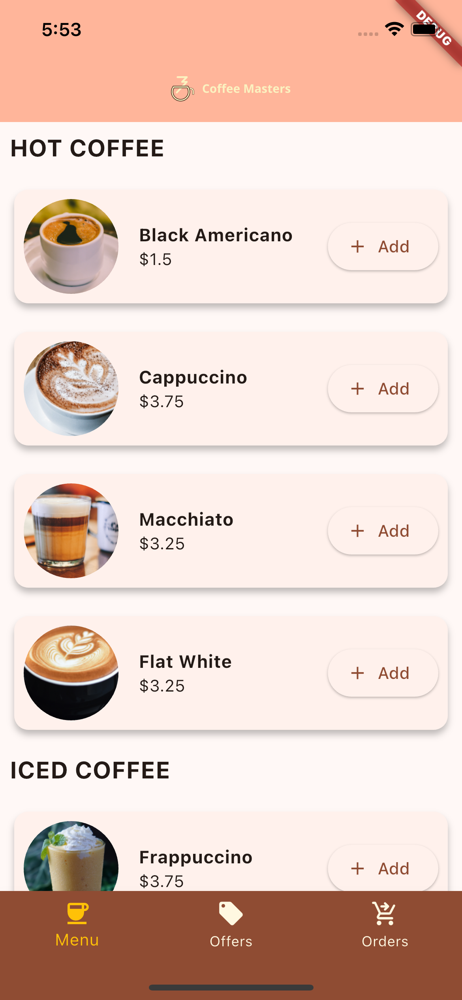
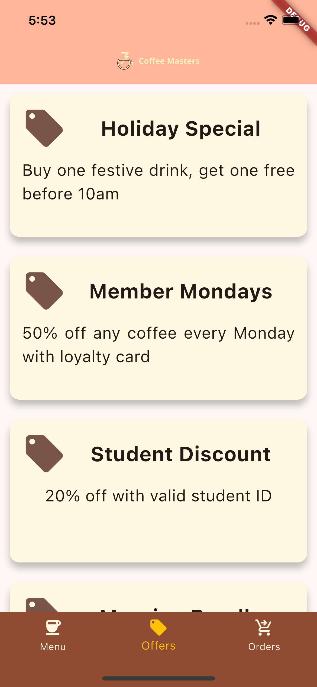
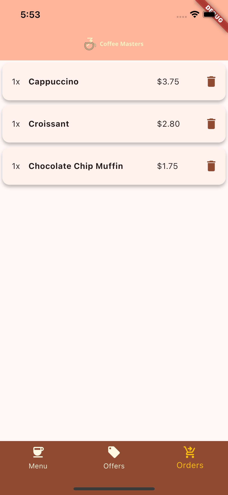

# ☕ Coffee Masters

**Coffee Masters** is a sleek, cross-platform mobile application built using Flutter. Designed to enhance the digital cafe experience, it offers users a seamless way to explore the menu, grab special offers, and keep track of their coffee orders – all in one place. Whether you're a casual coffee drinker or a connoisseur, Coffee Masters is your digital coffee companion.

---

## 📑 Table of Contents

1. [Overview](#-overview)
2. [Technologies](#-technologies)
3. [Packages & Libraries Used](#-packages--libraries-used)
4. [Getting Started](#-getting-started)
5. [Setup](#-setup)
6. [Features](#-features)
7. [Demo & Screenshots](#-demo--screenshots)
8. [Acknowledgments](#-acknowledgments)
9. [License](#-license)

---

## 🌟 Overview

The app mimics a digital café interface where users can:
- Explore a detailed coffee menu
- Browse ongoing offers and discounts
- Track and review their previous orders
- Add items to their cart for a smooth ordering experience

Ideal for demoing Flutter UI capabilities and app state handling, **Coffee Masters** is a clean example of building a multi-screen app using best practices.

---

## 💻 Technologies

| Technology | Description                                  |
|------------|----------------------------------------------|
| Flutter    | UI toolkit for building cross-platform apps  |
| Dart       | Programming language used with Flutter       |

---

## 📦 Packages / Libraries Used

| Package           | Purpose                                  |
|-------------------|------------------------------------------|
| **http**          | For making network requests               |

---

## 🚀 Getting Started

> Basic Flutter setup is required. You should have Flutter and Dart SDK installed.

1. Install Flutter by following the [official guide](https://docs.flutter.dev/get-started/install).
2. Set up your IDE (e.g., VS Code or Android Studio).
3. Ensure Git is installed and configured.

---

## ⚙️ Setup

1. Clone the repository:
   ```bash
   git clone https://github.com/Jenil-Desai/Coffee-Masters.git
   ```
2. Navigate into the project directory:
   ```bash
   cd coffee-masters
   ```
3. Install dependencies:
   ```bash
   flutter pub get
   ```
4. Run the app:
   ```bash
   flutter run
   ```

---

## 🎯 Features

- 📋 **Menu Screen** – Displays all available coffee items
- 💸 **Offers Screen** – Showcases ongoing deals and discounts
- 📦 **Orders Screen** – Tracks user's current and past orders
- 🛒 **Add to Cart** – Users can add items to their cart for ordering

---

## 📸 Demo & Screenshots

| Image | Description |
|-------|-------------|
|  | Coffee Masters app mockup showing the main interface |
|  | Menu screen displaying coffee items and categories |
|  | Offers screen showcasing special discounts and deals |
|  | Orders screen for tracking current and past purchases |

- [Download Now]()
- [Visit Website Now]()

---

## 🙏 Acknowledgments

- [Cross-platform mobile app built with Flutter](https://frontendmasters.com/courses/flutter/)

---

## 📜 License

This project is licensed under the [MIT License](LICENSE).

---

> Built with ☕ and 💙 using Flutter.